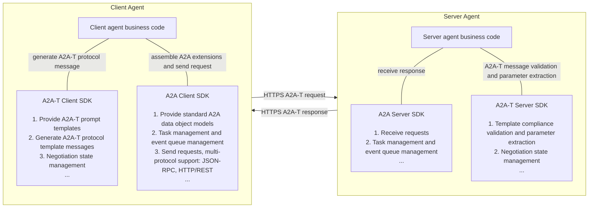
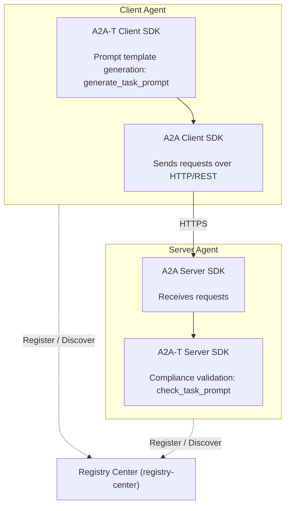

# 1 a2a-t-sdk-python Developer Guide

| Category       | Description                                                        |
| -------------- | ------------------------------------------------------------------ |
| Target readers | Developers, integration and deployment engineers, and project O&M personnel who build multi-agent protocol interactions based on the A2A-T SDK |
| Purpose        | This document describes the complete installation, parameter configuration, and minimal practices of the A2A-T SDK, helping users complete SDK integration, feature development, and production deployment quickly and consistently. |
| Prerequisites  | Familiar with the data model definitions and usage of the A2A multi-agent protocol, the AgentCard model definition and usage, and registry-center-related functions |

## 1.1 Feature Introduction

### 1.1.1 A2A-T Capabilities
A2A-T (Agent-to-Agent Telecom) is a multi-agent interconnection protocol for the telecom domain built on the A2A protocol, designed specifically for complex collaboration scenarios in the telecom domain.

General-purpose agent interconnection protocols in the industry mainly focus on agent interconnection and interaction frameworks, paying insufficient attention to business scenarios and specific interaction content, which results in a low task completion success rate. Business scenarios in the telecom domain are complex and demanding, so a dedicated protocol is required to support the interconnection and collaboration of O&M agents. Based on the A2A protocol, the A2A-T solution focuses on application extensions for enhanced capabilities such as information models, task negotiation, and collaboration security for telecom business flows.

a2a-t-sdk-python is a Python SDK for telecom agent collaboration scenarios. It is used to generate, validate, and negotiate task prompts in A2A-T interactions. The SDK is suitable for integration by client Agents, server Agents, and upper-layer orchestration systems.

Main capabilities include:

- **Task prompt generation**: The client generates A2A-T-conformant protocol messages from natural language or structured input.
- **Server-side prompt validation**: The server validates whether the A2A-T protocol message submitted by the client matches the scenario, template, and slot constraints.
- **Multi-round negotiation**: Supports `information`, `feasibility`, and `target` negotiation processes.
- **Prompt resource management**: Built-in scenario, slot, template, and system prompt resources, with support for local file resource loading.
- **LLM adaptation**: Connects to external large language models through OpenAI-compatible APIs.

### 1.1.2 Relationship Between the A2A-T SDK and the A2A SDK

The A2A-T protocol is an extension of the A2A protocol. The A2A-T SDK is provided for the extended protocol content, supporting rapid construction of agents for complex collaboration scenarios in the telecom domain. The A2A-T SDK is independent of the A2A SDK. By integrating both the A2A-T SDK and the A2A SDK, you can build agents that support the A2A-T protocol, enabling deterministic, highly reliable, efficient, and secure collaboration among multiple agents in the telecom domain.



## 1.2 Constraints and Limitations

1. Python 3.12+ is required.
2. Complete multi-agent protocol interaction development additionally requires `a2a-sdk` version 1.1.0+.
3. Negotiation state storage only provides `in_memory`; state is lost after the process exits.
4. The A2A-T SDK does not provide an agent HTTP service framework, registry-center client, authentication, or key management capabilities; these must be integrated by the business system.

## 1.3 Environment Preparation

### 1.3.1 Environment Requirements

| Item                | Requirement                                                        |
| ------------------- | ------------------------------------------------------------------ |
| Python SDK          | Python 3.12+                                                       |
| Dependency management | `uv` recommended                                                 |
| LLM                 | An accessible OpenAI service and API key                           |
| Operating system    | Linux, Windows, and macOS are all suitable for development and integration testing |

### 1.3.2 Setting Up the Environment

Taking a Windows 11 64-bit amd64 development environment as an example:

**Install Python 3.12**

1. Official download link: https://www.python.org/ftp/python/3.12.10/python-3.12.10-amd64.exe

2. Run `python-3.12.10-amd64.exe` as administrator

3. **Make sure to check**: Add Python 3.12 to PATH

4. After installation, open a terminal and run the verification command:

   ```shell
   python --version
   # Expected output: Python 3.12.10
   ```

**Install uv**

1. After installing Python, install uv using pip. In a terminal, run: `python -m pip install uv`

2. After installation, run the verification command:

   ```shell
   uv --version
   # Expected output: uv 0.12.1 (329541a50 2026-07-31 x86_64-pc-windows-msvc)
   ```

## 1.4 Basic Development Sample

### 1.4.1 System Architecture

A basic multi-agent collaboration interaction flow involves at least three components: a client Agent, a server Agent, and a registry center.

The basic architecture is as follows:




### 1.4.2 Sample API Description

This basic development sample mainly uses the following two A2A-T SDK APIs. In actual development, select the appropriate APIs based on your business requirements:

**1. A2A-T Client SDK**

Interface definition and function description: recognizes the scenario from the input and generates the corresponding prompt template.

```python
def generate_task_prompt(self, user_input: str | dict[str, object]) -> PromptGenerationResult
```

Sample call:

```python
client = A2ATClient()
result = client.generate_task_prompt("Generate an Incident event subscription task: the notification topic is Incident, the subscription levels are critical, medium, high, and low, and the notification data format is DataPart")

if result.success:
    print(result.prompt_text)

"""Output prompt template:
## Subscription Description
Based on the following <Notification Topic>, <Subscribe Condition>, <Notification Data Format>, and <Expected Output> information, complete the network-side intelligent fault Incident subscription and reporting task.

## Notification Topic
The name of this topic is "Incident"

## Subscribe Condition
Fault levels are "critical", "medium", "high", "low"

## Notification Data Format
Report Incident data via DataPart

## Expected Output
1. Subscription result, success or failure
2. Reason for subscription failure (optional)
"""
```

**2. A2A-T Server SDK**

Interface definition and function description:

```python
def check_task_prompt(self, *, processed_prompt_text: str) -> PromptComplianceResult
```

`PromptComplianceResult` is a dataclass with two attributes: `success: bool` and `failure: dict[str, str] | None` (carrying `code`, `message`, and `stage` on validation failure).

Sample call: validates the completeness of an A2A-T protocol message.

```python
server = A2ATServer()
result = server.check_task_prompt(processed_prompt_text="## Subscription Description Based on the following <Notification Topic>, <Subscribe Condition>, <Notification Data Format>, and <Expected Output> information, complete the network-side intelligent fault Incident subscription and reporting task. ## Notification Topic The name of this topic is \"Incident\" ## Subscribe Condition \n\n Fault levels are \"critical\", \"medium\", \"high\", \"low\" \n\n ## Notification Data Format \n\n Report Incident data via DataPart ## Expected Output 1. Subscription result, success or failure 2. Reason for subscription failure (optional)")

if result.success:
    print("prompt check passed")
else:
    print(result.failure)
```

### 1.4.3 Development Flow

- Client development flow:

```mermaid
flowchart LR
    Install dependencies --> Configure the LLM --> Initialize the A2A-T client --> Initialize the AgentCard --> AgentCard registration and discovery --> Generate the A2A-T template message --> Fill in the A2A-T request headers --> Send the request with A2A-T extensions
```

- Server development flow:

```mermaid
flowchart LR
    Install dependencies --> Configure the LLM --> Initialize the A2A-T server --> Initialize the AgentCard --> AgentCard registration and discovery --> Receive and validate the message --> Internal business logic processing --> Fill in the A2A response headers --> Return the response
```


### 1.4.4 Sample Client Development Steps

#### 1.4.4.1 Install Dependencies

```bash
# A2A-T SDK
pip install a2a-t-sdk

# Official A2A Python SDK
pip install a2a-sdk
```

> Request sending, response consumption, and server-side route assembly use the official `a2a-sdk` (whose transport layer depends on `httpx`). The registry center is outside the scope of the official SDK; this guide interacts with it directly using `httpx`, which business systems can replace with `requests` or any other HTTP client. Starting the HTTP service on the server side additionally requires `uvicorn`:
>
> ```bash
> pip install uvicorn
> ```

#### 1.4.4.2 Configure the LLM

Copy the content of `package_data/env.example` into `package_data/.env` and configure it as follows:

```properties
A2AT_LANGUAGE=en-US
A2AT_PROMPT_SOURCE_TYPE=local_file
A2AT_PROMPT_RESOURCE_LOCAL_ROOT_DIR=
A2AT_PROMPT_COMPLIANCE_ENABLED=true
A2AT_LLM_PROVIDER=openai
A2AT_LLM_MODEL=deepseek-chat
A2AT_LLM_API_KEY={your_llm_api_key}
A2AT_LLM_BASE_URL=https://api.deepseek.com
A2AT_NEGOTIATION_STATE_STORE_TYPE=in_memory
```

> `A2AT_LLM_API_KEY` is the key used to **call the external large language model**. Keep it safe.
>
> The SDK connects to external LLMs through OpenAI-compatible APIs. `A2AT_LLM_PROVIDER` currently only supports `openai`. To access DeepSeek or other OpenAI-compatible services, specify the service address via `A2AT_LLM_BASE_URL` and the model name via `A2AT_LLM_MODEL`.

#### 1.4.4.3 Initialize the A2A-T Client

```python
from pathlib import Path
from a2a_t.client.a2at_client import A2ATClient

client = A2ATClient(env_path=Path("package_data/.env"))
```

Both `A2ATClient` and `A2ATServer` accept an `env_path` argument; when omitted, `package_data/.env` is read by default.

#### 1.4.4.4 Initialize the AgentCard

Reference client sample AgentCard definition:

> The supported A2A-T templates can be declared in `extensions`.

```json
{
  "agentCards": [
    {
      "name": "Transmission workbench agent",
      "description": "Transmission network O&M management agent that provides capabilities such as circuit recovery verification, base station outage root cause analysis, and network element hidden danger inspection",
      "supportedInterfaces": [
        {
          "url": "http://10.xx.xx.xx:26335/a2a/v1",
          "protocolBinding": "HTTP+JSON",
          "protocolVersion": "1.0"
        }
      ],
      "provider": {
        "organization": "ZzNode"
      },
      "version": "1.0.0",
      "capabilities": {
        "streaming": true,
        "pushNotifications": false,
        "extensions": [
          {
            "uri": "https://projects.tmforum.org/a2aproject/telecommunication/extensions/Task-T/v1",
            "description": "Extension of structured prompt Task-T requests."
          },
          {
            "uri": "https://projects.tmforum.org/a2aproject/telecommunication/extensions/Notification-T/v1",
            "description": "Extension of structured prompt Notification-T requests."
          }
        ],
        "extendedAgentCard": false
      },
      "securitySchemes": {
        "bearerAuth": {
          "httpAuthSecurityScheme": {
            "description": "Query the accessSession through the login interface using the user name and password, then use the accessSession for bearer authentication.",
            "scheme": "Bearer"
          }
        }
      },
      "defaultInputModes": [
        "application/json",
        "text/plain"
      ],
      "defaultOutputModes": [
        "application/json",
        "text/plain"
      ],
      "skills": [
        {
          "id": "circuit-recovery-verification",
          "name": "Circuit recovery verification agent",
          "description": "Circuit service recovery verification skill. Uses the circuit name in the request, plugs it into a fixed JSON template, and returns the service recovery verification result. Use when the user mentions \"service recovery verification\", \"circuit recovery verification\", \"circuit recovery verification\", or similar requests. Applicable to scenarios where the service recovery status of a specified circuit needs to be confirmed.",
          "tags": [
            "circuit recovery verification",
            "service recovery verification",
            "circuit-recovery"
          ],
          "examples": [
            "Please perform service recovery verification for circuits LYSPELC3 and SN3 Phase 2 - LYXLSJLT Building 1 10GE1049641NR",
            "Perform service recovery verification for circuit XXX",
            "circuit recovery verification for circuit XXX"
          ],
          "inputModes": [
            "application/json",
            "text/plain"
          ],
          "outputModes": [
            "application/json",
            "text/plain"
          ]
        },
        {
          "id": "ne-hidden-danger",
          "name": "NE hidden danger inspection agent",
          "description": "Network element hidden danger inspection skill. Inspects whether the specified network element still has new hidden dangers based on the input NE name. Use when the user mentions \"hidden danger inspection\", \"check hidden dangers\", \"NE inspection\", \"ne hidden danger\", or similar requests. Applicable to scenarios where the hidden-danger status of a specified network element needs to be checked.",
          "tags": [
            "NE inspection",
            "hidden danger inspection",
            "NE-inspection"
          ],
          "examples": [
            "Please inspect whether NE QZHA-HAZBYSDGG-HRHH still produces new hidden dangers",
            "Inspect whether NE XXX still has hidden dangers",
            "Check if NE XXX has any hidden dangers"
          ],
          "inputModes": [
            "application/json",
            "text/plain"
          ],
          "outputModes": [
            "application/json",
            "text/plain"
          ]
        }
      ]
    }
  ]
}
```

AgentCards are stored in the registry center as JSON. When constructing the official A2A client or assembling server-side routes, convert the JSON into the official SDK's `a2a.types.AgentCard` object:

```python
from a2a.types import AgentCard
from google.protobuf.json_format import ParseDict

agent_card = ParseDict(agent_card_dict, AgentCard())
```

#### 1.4.4.5 AgentCard Registration and Discovery

- **AgentCard registration**: Publish the client AgentCard to the registry center. The registry center address and URI depend on the actual deployment.

```python
import httpx

AGENT_CARD = {...}  # AgentCard JSON defined in 1.4.4.4

def register_agent_card(registry_url: str, agent_card: dict) -> None:
    resp = httpx.post(
        registry_url,
        json=agent_card,
        timeout=10,
    )
    resp.raise_for_status()
```

- **AgentCard discovery**: Query the registry center by target Agent name or skill to obtain its AgentCard, which provides the `url` and supported skills.

```python
import httpx

def discover_agent(discover_url: str, task: str) -> dict:
    resp = httpx.post(
        discover_url,
        params={"task": task},
        timeout=10,
    )
    resp.raise_for_status()
    return resp.json()["agentCards"][0]
```

#### 1.4.4.6 Generate the A2A-T Template Message

The client uses the A2A-T Client SDK API to generate a processed_prompt, then sends it to the target agent as part of the A2A message.

```python
from a2a_t.client.a2at_client import A2ATClient

client = A2ATClient(env_path=Path("package_data/.env"))

# Generate the A2A-T prompt
result = client.generate_task_prompt("Generate an Incident event subscription task: the notification topic is Incident, the subscription levels are critical, medium, high, and low, and the notification data format is DataPart")
if not result.success:
    raise RuntimeError(result.failure.to_dict())

processed_prompt = result.prompt_text
```


#### 1.4.4.7 Fill In A2A-T Request Headers

The A2A protocol conveys the protocol version and extension declarations through HTTP headers. Use the following headers:

| Header           | Direction        | Required                            | Value                                                                  |
| ---------------- | ---------------- | ----------------------------------- | ---------------------------------------------------------------------- |
| `A2A-Version`    | Request header   | Yes                                 | Protocol version, e.g. `1.0` (the client must include it in every request) |
| `A2A-Extensions` | Request header   | No (recommended when using extensions) | Comma-separated list of extension URIs, declaring the extensions used by this request |

When using the official A2A Client, request headers are passed in through `ClientCallContext.service_parameters` (the key-value pairs are sent as HTTP request headers), and protocol headers such as `A2A-Version` are attached automatically by the official client:

```python
from a2a.client.client import ClientCallContext

NOTIFICATION_PROMPT_EXT = "https://projects.tmforum.org/a2aproject/telecommunication/extensions/Notification-T/v1"

ACCESS_TOKEN = "{your_access_token}"

context = ClientCallContext(
    service_parameters={
        "A2A-Extensions": NOTIFICATION_PROMPT_EXT,
        "Authorization": f"Bearer {ACCESS_TOKEN}",
    },
)
```

#### 1.4.4.8 Send a Request with A2A-T Extensions

Create the A2A client with the official `ClientFactory`, build the request with `SendMessageRequest` (the A2A-T processed prompt is placed in `message.metadata`, keyed by the extension URI), and declare the extension request headers through `ClientCallContext`:

```python
import uuid

from a2a.client.client import ClientCallContext, ClientConfig
from a2a.client.client_factory import ClientFactory
from a2a.types import AgentCard, Role, SendMessageRequest
from a2a.utils.constants import TransportProtocol

from pathlib import Path
from a2a_t.client.a2at_client import A2ATClient
from google.protobuf.json_format import ParseDict

NOTIFICATION_PROMPT_EXT = "https://projects.tmforum.org/a2aproject/telecommunication/extensions/Notification-T/v1"

ACCESS_TOKEN = "{your_access_token}"

# 1) Generate the A2A-T prompt
client = A2ATClient(env_path=Path("package_data/.env"))
result = client.generate_task_prompt("Generate an Incident event subscription task: the notification topic is Incident, the subscription levels are critical, medium, high, and low, and the notification data format is DataPart")
if not result.success:
    raise RuntimeError(result.failure.to_dict())

processed_prompt = result.prompt_text

# 2) Create the official A2A client (the AgentCard comes from the registry center; see 1.4.4.5)
agent_card = ParseDict(agent_card_dict, AgentCard())
a2a_client = ClientFactory(
    ClientConfig(
        supported_protocol_bindings=[TransportProtocol.HTTP_JSON],
        use_client_preference=True,
    )
).create(agent_card)

# 3) Build the request (headers declare the extension; the body carries the A2A-T extension field)
request = SendMessageRequest()
request.message.message_id = str(uuid.uuid4())
request.message.role = Role.ROLE_USER
request.message.parts.add().text = "Create an intelligent fault Incident reporting task"
request.message.metadata[NOTIFICATION_PROMPT_EXT] = processed_prompt

context = ClientCallContext(
    service_parameters={
        "A2A-Extensions": NOTIFICATION_PROMPT_EXT,
        "Authorization": f"Bearer {ACCESS_TOKEN}",
    },
)

# 4) Send the request and consume the response stream (StreamResponse: status_update / artifact_update / message)
async for stream_response in a2a_client.send_message(request, context=context):
    if stream_response.HasField("status_update"):
        print("status:", stream_response.status_update.status.state)
    elif stream_response.HasField("artifact_update"):
        print("artifact:", stream_response.artifact_update.artifact.name)
    elif stream_response.HasField("message"):
        print("message:", stream_response.message.parts[0].text)

await a2a_client.close()
```

#### 1.4.4.9 Complete Sample Client Code

```python
import asyncio
import uuid
from pathlib import Path

import httpx
from a2a.client.client import ClientCallContext, ClientConfig
from a2a.client.client_factory import ClientFactory
from a2a.types import AgentCard, Role, SendMessageRequest
from a2a.utils.constants import TransportProtocol
from a2a_t.client.a2at_client import A2ATClient
from google.protobuf.json_format import ParseDict

NOTIFICATION_PROMPT_EXT = "https://projects.tmforum.org/a2aproject/telecommunication/extensions/Notification-T/v1"

ACCESS_TOKEN = "{your_access_token}"

AGENT_CARD = {...}  # AgentCard JSON defined in 1.4.4.4

def register_agent_card(registry_url: str, agent_card: dict) -> None:
    resp = httpx.post(
        registry_url,
        json=agent_card,
        timeout=10,
    )
    resp.raise_for_status()

def discover_agent(discover_url: str, task: str) -> dict:
    resp = httpx.post(
        discover_url,
        params={"task": task},
        timeout=10,
    )
    resp.raise_for_status()
    return resp.json()["agentCards"][0]

async def main() -> None:
    # 1) Register the client AgentCard and discover the server AgentCard
    #    (the registry center is a business-system-side component)
    register_agent_card("{ip:port}/rest/v1/registry-center/agent-cards", AGENT_CARD)
    agent_card_dict = discover_agent("{ip:port}/rest/v1/registry-center/agent-cards/semantic-query", task="Need to subscribe to faults")

    # 2) Use the SDK to generate the A2A-T prompt
    client = A2ATClient(env_path=Path("package_data/.env"))
    result = client.generate_task_prompt("Generate an Incident event subscription task: the notification topic is Incident, the subscription levels are critical, medium, high, and low, and the notification data format is DataPart")
    if not result.success:
        raise RuntimeError(result.failure.to_dict())

    processed_prompt = result.prompt_text

    # 3) Create the official A2A client
    agent_card = ParseDict(agent_card_dict, AgentCard())
    a2a_client = ClientFactory(
        ClientConfig(
            supported_protocol_bindings=[TransportProtocol.HTTP_JSON],
            use_client_preference=True,
        )
    ).create(agent_card)

    # 4) Build the request (headers declare the extension; the body carries the A2A-T extension field)
    request = SendMessageRequest()
    request.message.message_id = str(uuid.uuid4())
    request.message.role = Role.ROLE_USER
    request.message.parts.add().text = "Create an intelligent fault Incident reporting task"
    request.message.metadata[NOTIFICATION_PROMPT_EXT] = processed_prompt

    context = ClientCallContext(
        service_parameters={
            "A2A-Extensions": NOTIFICATION_PROMPT_EXT,
            "Authorization": f"Bearer {ACCESS_TOKEN}",
        },
    )

    # 5) Send the request and consume the response stream
    async for stream_response in a2a_client.send_message(request, context=context):
        if stream_response.HasField("status_update"):
            print("status:", stream_response.status_update.status.state)
        elif stream_response.HasField("artifact_update"):
            print("artifact:", stream_response.artifact_update.artifact.name)
        elif stream_response.HasField("message"):
            print("message:", stream_response.message.parts[0].text)

    await a2a_client.close()

asyncio.run(main())
```

### 1.4.5 Sample Server Development Steps

#### 1.4.5.1 Prerequisites

Steps such as installing dependencies, configuring the LLM, initializing the AgentCard, and AgentCard registration and discovery can be found in the [client implementation](#14141-install-dependencies). The differences are as follows:

- Initialize the A2A-T server

```python
from pathlib import Path
from a2a_t.server.a2at_server import A2ATServer

server = A2ATServer(env_path=Path("package_data/.env"))
```

- Initialize the AgentCard. Reference server sample AgentCard definition:

```json
{
  "agentCards": [
    {
      "name": "RAN Domain Agent",
      "description": "RAN Domain Agent",
      "provider": {
        "organization": "Huawei",
        "url": "https://www.huawei.com"
      },
      "version": "1.0.0",
      "capabilities": {
        "streaming": true,
        "pushNotifications": false,
        "extendedAgentCard": false,
        "extensions": [
          {
            "description": "Extension of structured prompt TASK-T requests.",
            "required": false,
            "uri": "https://projects.tmforum.org/a2aproject/telecommunication/extensions/Task-T/v1"
          },
          {
            "description": "Extension of structured prompt Notification-T requests.",
            "required": false,
            "uri": "https://projects.tmforum.org/a2aproject/telecommunication/extensions/Notification-T/v1"
          }
        ]
      },
      "defaultInputModes": [
        "application/json",
        "text/plain"
      ],
      "defaultOutputModes": [
        "application/json",
        "text/plain"
      ],
      "skills": [
        {
          "id": "ran-incident-subscription",
          "name": "Incident Reporting",
          "description": "Supports Incident reporting and provides intelligent fault identification and diagnosis capabilities",
          "tags": [
            "Incident Reporting"
          ],
          "examples": [
            "## Subscription Description\nBased on the following <Notification Topic>, <Subscribe Condition>, <Notification Data Format>, and <Expected Output> information, complete the network-side intelligent fault Incident subscription and reporting task.\n## Notification Topic\nThe name of this topic is \"Incident\"\n## Subscribe Condition\nFault level is \"high\"\n## Notification Data Format\nReport Incident data via DataPart\n## Expected Output\n1. Subscription result, success or failure\n2. Reason for subscription failure (optional)"
          ],
          "inputModes": [
            "application/json",
            "text/plain"
          ],
          "outputModes": [
            "application/json",
            "text/plain"
          ]
        }
      ],
      "securitySchemes": {
        "bearerAuth": {
          "httpAuthSecurityScheme": {
            "scheme": "Bearer",
            "description": "Query the accessSession through the login interface using the user name and password, then use the accessSession for bearer authentication."
          }
        }
      },
      "securityRequirements": [],
      "supportedInterfaces": [
        {
          "protocolBinding": "JSONRPC",
          "url": "https://10.xx.xx.xx:27417/a2a/v1",
          "tenant": "",
          "protocolVersion": "1.0"
        },
        {
          "protocolBinding": "HTTP+JSON",
          "url": "https://10.xx.xx.xx:27417/a2a/json",
          "tenant": "",
          "protocolVersion": "1.0"
        }
      ]
    }
  ]
}
```

#### 1.4.5.2 Receive and Validate the Message

The official A2A Server invokes business logic through the `AgentExecutor` callback. In the `execute` callback: first validate the extension request headers declared by the client from the `RequestContext`, then extract the processed task prompt from `message.metadata` (keyed by the extension URI), pass it to `A2ATServer.check_task_prompt` for validation, and finally push task statuses to the `EventQueue` according to the validation result:

```python
import uuid

from a2a.server.agent_execution.agent_executor import AgentExecutor
from a2a.server.agent_execution.context import RequestContext
from a2a.server.events.event_queue import EventQueue
from a2a.types import Artifact, Message, Role, Task, TaskState, TaskStatus, TaskStatusUpdateEvent
from google.protobuf.json_format import MessageToDict, ParseDict
from google.protobuf.struct_pb2 import Value

from pathlib import Path
from a2a_t.server.a2at_server import A2ATServer

NOTIFICATION_PROMPT_EXT = "https://projects.tmforum.org/a2aproject/telecommunication/extensions/Notification-T/v1"

class NotificationAgentExecutor(AgentExecutor):
    """Server-side executor that handles Notification-T extension requests."""

    def __init__(self, prompt_server: A2ATServer) -> None:
        self._prompt_server = prompt_server

    async def execute(self, context: RequestContext, event_queue: EventQueue) -> None:
        task_id = context.task_id or ""
        context_id = context.context_id or ""

        # 1) Validate the A2A-T extension declared by the client (A2A-Extensions request header)
        if NOTIFICATION_PROMPT_EXT not in context.requested_extensions:
            raise ValueError("missing Notification-T extension")

        # 2) Extract the processed task prompt from message.metadata
        if context.message is None or context.message.metadata is None:
            raise ValueError("missing A2A-T task prompt")
        processed_prompt = str(MessageToDict(context.message.metadata).get(NOTIFICATION_PROMPT_EXT, ""))

        # 3) Push the SUBMITTED status
        task = Task(
            id=task_id,
            context_id=context_id,
            status=TaskStatus(
                state=TaskState.TASK_STATE_SUBMITTED,
                message=self._build_message(task_id, context_id, "subscription accepted"),
            ),
        )
        context.current_task = Task()
        context.current_task.CopyFrom(task)
        await event_queue.enqueue_event(task)

        # 4) Use the A2A-T SDK to validate completeness
        check_result = self._prompt_server.check_task_prompt(processed_prompt_text=processed_prompt)
        if not check_result.success:
            # Validation failed: push REJECTED (failure carries code, message, and stage)
            await self._emit_status(event_queue, task_id, context_id, TaskState.TASK_STATE_REJECTED, f"prompt validation failed: {check_result.failure}")
            return

        # 5) Validation passed: WORKING -> execute the business and push the artifact -> COMPLETED
        await self._emit_status(event_queue, task_id, context_id, TaskState.TASK_STATE_WORKING, "incident reporting in progress")

        artifact = Artifact(artifact_id=str(uuid.uuid4()), name="faultManagement.Incident")
        artifact.parts.add(data=ParseDict(execute_business(processed_prompt), Value()))
        await event_queue.enqueue_event(
            TaskArtifactUpdateEvent(task_id=task_id, context_id=context_id, artifact=artifact, last_chunk=True)
        )

        await self._emit_status(event_queue, task_id, context_id, TaskState.TASK_STATE_COMPLETED, "task completed")

    async def cancel(self, context: RequestContext, event_queue: EventQueue) -> None:
        return None

    @staticmethod
    def _build_message(task_id: str, context_id: str, text: str) -> Message:
        message = Message(task_id=task_id, context_id=context_id, role=Role.ROLE_AGENT)
        message.parts.add(text=text)
        return message

    async def _emit_status(
        self,
        event_queue: EventQueue,
        task_id: str,
        context_id: str,
        state: TaskState,
        text: str,
    ) -> None:
        await event_queue.enqueue_event(
            TaskStatusUpdateEvent(
                task_id=task_id,
                context_id=context_id,
                status=TaskStatus(state=state, message=self._build_message(task_id, context_id, text)),
            )
        )

```

#### 1.4.5.3 Assemble the Server Application

Use the official SDK's `DefaultRequestHandler` to assemble the request handler, together with `create_agent_card_routes` and `create_rest_routes` to generate the protocol routes (AgentCard queries, task/message handling, SSE streaming, etc.). Protocol header parsing and responses are handled by the official SDK; the business side does not need to process HTTP messages manually:

```python
from a2a.server.request_handlers import DefaultRequestHandler
from a2a.server.routes import create_agent_card_routes, create_rest_routes
from a2a.server.tasks.inmemory_task_store import InMemoryTaskStore
from a2a.types import AgentCard
from google.protobuf.json_format import ParseDict
from starlette.applications import Starlette

agent_card = ParseDict(AGENT_CARD["agentCards"][0], AgentCard())

request_handler = DefaultRequestHandler(
    agent_executor=executor,       # NotificationAgentExecutor defined in 1.4.5.2
    task_store=InMemoryTaskStore(),
    agent_card=agent_card,
)

app = Starlette(routes=[
    *create_agent_card_routes(agent_card),
    *create_rest_routes(request_handler),
])
```

#### 1.4.5.4 Complete Sample Server Code

```python
import uuid
from pathlib import Path

import httpx
import uvicorn
from a2a.server.agent_execution.agent_executor import AgentExecutor
from a2a.server.agent_execution.context import RequestContext
from a2a.server.events.event_queue import EventQueue
from a2a.server.request_handlers import DefaultRequestHandler
from a2a.server.routes import create_agent_card_routes, create_rest_routes
from a2a.server.tasks.inmemory_task_store import InMemoryTaskStore
from a2a.types import AgentCard, Artifact, Message, Role, Task, TaskState, TaskStatus, TaskStatusUpdateEvent
from a2a_t.server.a2at_server import A2ATServer
from google.protobuf.json_format import MessageToDict, ParseDict
from google.protobuf.struct_pb2 import Value
from starlette.applications import Starlette

NOTIFICATION_PROMPT_EXT = "https://projects.tmforum.org/a2aproject/telecommunication/extensions/Notification-T/v1"

AGENT_CARD = {...}  # AgentCard JSON defined in 1.4.5.1

def register_agent_card(registry_url: str, agent_card: dict) -> None:
    resp = httpx.post(
        registry_url,
        json=agent_card,
        timeout=10,
    )
    resp.raise_for_status()

class NotificationAgentExecutor(AgentExecutor):
    """Server-side executor that handles Notification-T extension requests."""

    def __init__(self, prompt_server: A2ATServer) -> None:
        self._prompt_server = prompt_server

    async def execute(self, context: RequestContext, event_queue: EventQueue) -> None:
        task_id = context.task_id or ""
        context_id = context.context_id or ""

        # 1) Validate the A2A-T extension declared by the client (A2A-Extensions request header)
        if NOTIFICATION_PROMPT_EXT not in context.requested_extensions:
            raise ValueError("missing Notification-T extension")

        # 2) Extract the processed task prompt from message.metadata
        if context.message is None or context.message.metadata is None:
            raise ValueError("missing A2A-T task prompt")
        processed_prompt = str(MessageToDict(context.message.metadata).get(NOTIFICATION_PROMPT_EXT, ""))

        # 3) Push the SUBMITTED status
        task = Task(
            id=task_id,
            context_id=context_id,
            status=TaskStatus(
                state=TaskState.TASK_STATE_SUBMITTED,
                message=self._build_message(task_id, context_id, "subscription accepted"),
            ),
        )
        context.current_task = Task()
        context.current_task.CopyFrom(task)
        await event_queue.enqueue_event(task)

        # 4) Use the A2A-T SDK to validate completeness
        check_result = self._prompt_server.check_task_prompt(processed_prompt_text=processed_prompt)
        if not check_result.success:
            # Validation failed: push REJECTED (failure carries code, message, and stage)
            await self._emit_status(event_queue, task_id, context_id, TaskState.TASK_STATE_REJECTED, f"prompt validation failed: {check_result.failure}")
            return

        # 5) Validation passed: WORKING -> execute the business and push the artifact -> COMPLETED
        await self._emit_status(event_queue, task_id, context_id, TaskState.TASK_STATE_WORKING, "incident reporting in progress")

        artifact = Artifact(artifact_id=str(uuid.uuid4()), name="faultManagement.Incident")
        artifact.parts.add(data=ParseDict(execute_business(processed_prompt), Value()))
        await event_queue.enqueue_event(
            TaskArtifactUpdateEvent(task_id=task_id, context_id=context_id, artifact=artifact, last_chunk=True)
        )

        await self._emit_status(event_queue, task_id, context_id, TaskState.TASK_STATE_COMPLETED, "task completed")

    async def cancel(self, context: RequestContext, event_queue: EventQueue) -> None:
        return None

    @staticmethod
    def _build_message(task_id: str, context_id: str, text: str) -> Message:
        message = Message(task_id=task_id, context_id=context_id, role=Role.ROLE_AGENT)
        message.parts.add(text=text)
        return message

    async def _emit_status(
        self,
        event_queue: EventQueue,
        task_id: str,
        context_id: str,
        state: TaskState,
        text: str,
    ) -> None:
        await event_queue.enqueue_event(
            TaskStatusUpdateEvent(
                task_id=task_id,
                context_id=context_id,
                status=TaskStatus(state=state, message=self._build_message(task_id, context_id, text)),
            )
        )

# 1) Register the server AgentCard (the registry center is a business-system-side component)
register_agent_card("{ip:port}/rest/v1/registry-center/agent-cards", AGENT_CARD)

# 2) Initialize the A2A-T server and the executor
server = A2ATServer(env_path=Path("package_data/.env"))
executor = NotificationAgentExecutor(prompt_server=server)

# 3) Assemble the official A2A server application
agent_card = ParseDict(AGENT_CARD["agentCards"][0], AgentCard())
request_handler = DefaultRequestHandler(
    agent_executor=executor,
    task_store=InMemoryTaskStore(),
    agent_card=agent_card,
)
app = Starlette(routes=[
    *create_agent_card_routes(agent_card),
    *create_rest_routes(request_handler),
])

# 4) Start the service
uvicorn.run(app, host="0.0.0.0", port=8000)
```

## 1.5 FAQ
