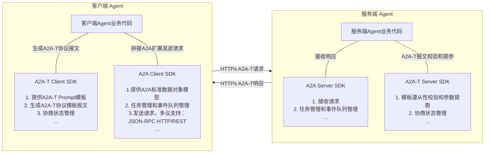
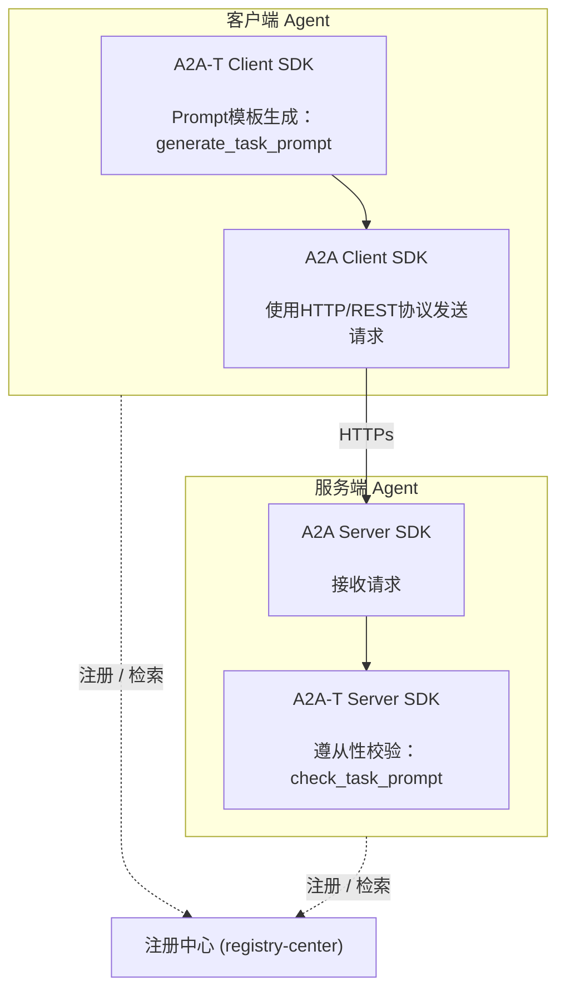
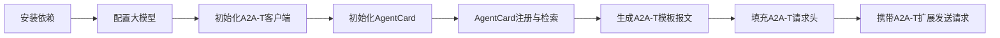
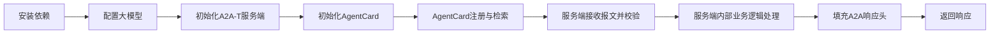

# 1 a2a-t-sdk-python 开发指南

| 分类     | 说明                                                         |
| -------- | ------------------------------------------------------------ |
| 目标读者 | 基于A2A-T SDK进行多智能体协议交互的开发者、集成部署人员、项目对接运维人员 |
| 文档目的 | 本文档详细介绍A2A-T SDK的完整安装方式、参数配置及最小实践。帮助使用者快速、规范地完成SDK接入、功能开发和线上落地。 |
| 阅读前提 | 了解A2A多智能体协议的数据模型定义和使用，了解AgentCard模型定义和使用，了解注册中心相关功能 |

## 1.1 特性介绍

### 1.1.1 什么是A2A-T？
A2A-T（Agent-to-Agent Telecom）是基于A2A协议推出的电信领域多智能体互联协议，专为电信领域复杂协同场景设计。

业界通用智能体互联协议主要关注智能体互联和交互框架，对业务场景和具体交互内容关注不足，导致任务完成的成功率不高。电信领域的业务场景复杂、要求高，运维智能体互联和协同需要有专门的协议进行支撑。A2A-T方案基于A2A协议，重点针对电信领域业务流相关的信息模型、任务协商、协作安全等增强能力进行应用扩展。

### 1.1.2 A2A-T SDK与A2A SDK的关系

A2A-T协议是基于A2A协议的扩展，针对协议扩展的内容提供了A2A-T SDK，支撑快速构建满用于电信领域复杂协同场景的智能体。A2A-T SDK独立于A2A SDK，通过同时集成A2A-T SDK与A2A SDK可以构建支持A2A-T协议的agent，支持电信领域多agent之间的确定性、高可靠、高效及安全协同。



### 1.1.3 能力介绍（待确认刷新）

a2a-t-sdk-python是面向电信智能体协作场景的 Python SDK，用于在 A2A-T 交互中生成、校验和协商任务提示词。SDK 适合客户端 Agent、服务端 Agent 以及上层编排系统集成使用。

主要能力包括：

- **任务提示词生成**：客户端根据自然语言或结构化输入生成符合 A2A-T 格式的 processed task prompt。
- **服务端提示词校验**：服务端校验客户端下发的 processed task prompt 是否匹配场景、模板和槽位约束。
- **多轮协商**：支持`information`协商流程。
- **提示词资源管理**：内置场景、槽位、模板和系统提示词资源，支持本地文件资源加载。
- **LLM 适配**：通过 OpenAI-compatible 调用链接入外部大模型。

## 1.2 约束与限制

1. Python 版本要求为 3.12+。
2. 完整的多智能体协议交互开发需要同时引入`a2a-sdk`，要求版本为 1.1.0+
3. 协商状态存储仅提供 `in_memory`，进程退出后状态丢失。
4. A2A-T SDK 不提供 Agent HTTP 服务框架、注册中心客户端、鉴权和密钥管理能力，需由业务系统集成。

## 1.3 环境准备

### 1.3.1 环境要求

| 项目       | 要求                                     |
| ---------- | ---------------------------------------- |
| Python SDK | Python 3.12+                             |
| 依赖管理   | 推荐使用 `uv`                            |
| LLM        | 需要可访问的 OpenAI 服务及 API Key       |
| 操作系统   | Linux、Windows、macOS 均可用于开发和联调 |

### 1.3.2 搭建环境

以Windows11 64位 amd64 开发环境为例

**安装Python 3.12**

1. 官网下载链接：https://www.python.org/ftp/python/3.12.10/python-3.12.10-amd64.exe

2. 以管理员身份执行`python-3.12.10-amd64.exe`

3. **务必勾选**：Add Python 3.12 to PATH

4. 安装完成，打开终端输入校验命令：

   ```shell
   python --version
   # 预期输出：Python 3.12.10
   ```

**安装uv**

1. 安装完Python之后，使用pip安装uv，在终端中输入：`python -m pip install uv`

2. 安装完成，输入校验命令：

   ```shell
   uv --version
   # 预期输出：uv 0.12.1 (329541a50 2026-07-31 x86_64-pc-windows-msvc)
   ```

## 1.4 基础开发样例

### 1.4.1 系统架构

一个基础多智能体协作交互流程涉及到至少三个组件：客户端Agent、服务端Agent、注册中心

基础架构如下：




### 1.4.2 样例接口说明

本基础开发样例主要使用到A2A-T SDK如下两个API，实际开发过程中需按业务实际诉求选择不同API使用：

**1、A2A-T Client SDK**

接口定义及功能描述：根据输入内容识别场景生成对应的Prompt模板

```python
def generate_task_prompt(self, user_input: str | dict[str, object]) -> PromptGenerationResult
```

接口调用样例：

```python
client = A2ATClient()
result = client.generate_task_prompt("请生成一个Incident事件订阅任务：通知主题为Incident，订阅级别为critical、medium、high、low，上报通知数据格式为DataPart")

if result.success:
    print(result.prompt_text)

"""输出生成的prompt模板
## 订阅描述
请根据以下 <通知主题>、<订阅条件>、<上报通知数据格式>及<预期输出> 信息，完成网络侧智能故障Incident订阅与上报任务。

## 通知主题
通知主题该主题的名称是“incident”

## 订阅条件
故障级别为“critical”、“medium”、“high”、“low”

## 上报通知数据格式
通过DataPart上报Incident数据

## 预期输出
1、订阅结果，成功或失败
2、订阅失败原因（可选）
"""
```

**2、A2A-T Server SDK**

接口定义及功能描述：

```python
def check_task_prompt(self, *, processed_prompt_text: str) -> PromptComplianceResult
```

`PromptComplianceResult` 为数据类，包含两个属性：`success: bool` 和 `failure: dict[str, str] | None`（校验失败时携带 `code`、`message`、`stage`）。

接口调用样例：校验A2A-T协议报文的完备性

```python
server = A2ATServer()
result = server.check_task_prompt(processed_prompt_text="## 订阅描述请根据以下 <通知主题>、<订阅 条件>、<上报通知数据格式> 及 <预期输出> 信息，完成网络侧智能故障Incident的订阅与上报任务。## 通知主题该主题的名称是“incident”## 订阅条件 \n\n 故障级别为“critical”、“medium”、“high”、“low” \n\n ## 上报通知数据格式 \n\n通过DataPart上报Incident数据## 预期输出1、订阅结果，成功或失败2、订阅失 败原因（可选）")

if result.success:
    print("prompt check passed")
else:
    print(result.failure)
```

### 1.4.3 开发流程

- 客户端开发流程



- 服务端开发流程：




### 1.4.4 样例客户端开发步骤

#### 1.4.4.1 安装依赖

```bash
# A2A-T SDK
pip install a2a-t-sdk

# A2A 官方 Python SDK
pip install a2a-sdk
```

> 本指南后续示例使用 `httpx` 演示业务系统侧的 HTTP 请求，`httpx` 不是 `a2a-t-sdk` 的依赖，业务系统可替换为 `requests` 等任意 HTTP 客户端。

#### 1.4.4.2 配置大模型（待确认刷新）

复制`package_data/env.example`文件内容到`package_data/.env`中，配置如下内容

```properties
A2AT_LANGUAGE=zh-CN
A2AT_PROMPT_SOURCE_TYPE=local_file
A2AT_PROMPT_RESOURCE_LOCAL_ROOT_DIR=
A2AT_PROMPT_COMPLIANCE_ENABLED=true
A2AT_LLM_PROVIDER=openai
A2AT_LLM_MODEL=deepseek-chat
A2AT_LLM_API_KEY={your_llm_api_key}
A2AT_LLM_BASE_URL=https://api.deepseek.com
A2AT_NEGOTIATION_STATE_STORE_TYPE=in_memory
```

> `A2AT_LLM_API_KEY` 是**调用外部大模型**使用的密钥，请妥善保存
>
> SDK 通过 OpenAI-compatible 接入外部大模型，`A2AT_LLM_PROVIDER` 当前仅支持 `openai`；接入 DeepSeek 等 OpenAI 兼容服务时，通过 `A2AT_LLM_BASE_URL` 指定服务地址、`A2AT_LLM_MODEL` 指定模型名。

#### 1.4.4.3 初始化A2A-T客户端

```python
from pathlib import Path
from a2a_t.client.a2at_client import A2ATClient

client = A2ATClient(env_path=Path("package_data/.env"))
```

`A2ATClient` 与 `A2ATServer` 均可传入 `env_path`；不传时默认读取 `package_data/.env`。

#### 1.4.4.4 初始化AgentCard

客户端样例AgentCard定义参考：

> 可在`extensions`中声明支持的A2A-T模板

```json
{
  "agentCards": [
    {
      "name": "Transmission workbench agent",
      "description": "传输网络运维管理智能体，提供电路恢复验证、基站退服根因分析、网元隐患排查等运维能力",
      "supportedInterfaces": [
        {
          "url": "http://10.xx.xx.xx:26335/a2a/v1",
          "protocolBinding": "HTTP+JSON",
          "protocolVersion": "1.0"
        }
      ],
      "provider": {
        "organization": "ZzNode"
      },
      "version": "1.0.0",
      "capabilities": {
        "streaming": true,
        "pushNotifications": false,
        "extensions": [
          {
            "uri": "https://projects.tmforum.org/a2aproject/telecommunication/extensions/Task-T/v1",
            "description": "Extension of structured prompt Task-T requests."
          },
          {
            "uri": "https://projects.tmforum.org/a2aproject/telecommunication/extensions/Notification-T/v1",
            "description": "Extension of structured prompt Notification-T requests."
          }
        ],
        "extendedAgentCard": false
      },
      "securitySchemes": {
        "bearerAuth": {
          "httpAuthSecurityScheme": {
            "description": "使用用户名和密码通过登录接口查询accessSession后，使用该accessSession进行bearer认证。",
            "scheme": "Bearer"
          }
        }
      },
      "defaultInputModes": [
        "application/json",
        "text/plain"
      ],
      "defaultOutputModes": [
        "application/json",
        "text/plain"
      ],
      "skills": [
        {
          "id": "circuit-recovery-verification",
          "name": "电路恢复验证智能体",
          "description": "电路业务恢复验证技能。根据请求中的电路名称，代入固定JSON模板返回业务恢复验证结果。当用户提到“业务恢复验证”、“电路恢复验证”、“circuit recovery verification”或类似请求时使用。适用于需要对指定电路进行业务恢复状态确认的场景。",
          "tags": [
            "电路恢复验证",
            "业务恢复验证",
            "circuit-recovery"
          ],
          "examples": [
            "请对电路：LYSPELC3、SN3二期-LYXLSJLT1号楼10GE1049641NR进行业务恢复验证",
            "对电路XXX进行业务恢复验证",
            "circuit recovery verification for circuit XXX"
          ],
          "inputModes": [
            "application/json",
            "text/plain"
          ],
          "outputModes": [
            "application/json",
            "text/plain"
          ]
        },
        {
          "id": "ne-hidden-danger",
          "name": "网元隐患排查智能体",
          "description": "网元隐患排查技能。根据输入的网元名称，排查该网元是否还存在新的隐患。当用户提到“隐患排查”、“检查隐患”、“网元排查”、“ne hidden danger”或类似请求时使用。适用于需要对指定网元进行隐患状态检查的场景。",
          "tags": [
            "网元排查",
            "隐患排查",
            "NE-inspection"
          ],
          "examples": [
            "请排查QZHA-HAZBYSDGG-HRHH网元是否还产生新隐患",
            "排查网元XXX是否还存在隐患",
            "Check if NE XXX has any hidden dangers"
          ],
          "inputModes": [
            "application/json",
            "text/plain"
          ],
          "outputModes": [
            "application/json",
            "text/plain"
          ]
        }
      ]
    }
  ]
}
```

#### 1.4.4.5 AgentCard注册与检索

- **AgentCard注册**：将客户端AgentCard发布到注册中心，注册中心的地址和URI以实际部署情况为准

```python
import httpx

AGENT_CARD = {...}  # 1.4.4.4 定义的 AgentCard JSON

def register_agent_card(registry_url: str, agent_card: dict) -> None:
    resp = httpx.post(
        registry_url,
        json=agent_card,
        timeout=10,
    )
    resp.raise_for_status()
```

- **AgentCard检索**：根据目标Agent名称或技能，从注册中心查询并获取其 AgentCard，从而得到 `url` 和支持的技能

```python
import httpx

def discover_agent(discover_url: str, task: str) -> dict:
    resp = httpx.post(
        discover_url,
        params={"task": task},
        timeout=10,
    )
    resp.raise_for_status()
    return resp.json()["agentCards"][0]
```

#### 1.4.4.6 生成A2A-T模板报文

客户端使用A2A-T Client SDK API生成 processed_prompt，再将其作为 A2A 消息的一部分发送给目标 agent。

```python
from a2a_t.client.a2at_client import A2ATClient

client = A2ATClient(env_path=Path("package_data/.env"))

# 生成 A2A-T 提示词
result = client.generate_task_prompt("请生成一个Incident事件订阅任务：通知主题为Incident，订阅级别为critical、medium、high、low，上报通知数据格式为DataPart")
if not result.success:
    raise RuntimeError(result.failure.to_dict())

processed_prompt = result.prompt_text
```


#### 1.4.4.7 填充A2A-T 请求头

A2A 协议通过 HTTP Header 传递协议版本与扩展声明，需使用如下Header

| Header           | 方向   | 必填                 | 取值                                              |
| ---------------- | ------ | -------------------- | ------------------------------------------------- |
| `A2A-Version`    | 请求头 | 是                   | 协议版本，如 `1.0`（客户端必须随每个请求携带）    |
| `A2A-Extensions` | 请求头 | 否（使用扩展时建议） | 逗号分隔的扩展 URI 列表，声明本次请求要使用的扩展 |

客户端请求头填写样例

```python
import httpx

NOTIFICATION_PROMPT_EXT = "https://projects.tmforum.org/a2aproject/telecommunication/extensions/Notification-T/v1"

HEADERS = {
    "Content-Type": "application/json",
    "A2A-Version": "1.0",
    "A2A-Extensions": NOTIFICATION_PROMPT_EXT,
}
```

#### 1.4.4.8 携带A2A-T扩展发送请求

```python
import httpx

from pathlib import Path
from a2a_t.client.a2at_client import A2ATClient

NOTIFICATION_PROMPT_EXT = "https://projects.tmforum.org/a2aproject/telecommunication/extensions/Notification-T/v1"

ACCESS_TOKEN = "{your_access_token}"

client = A2ATClient(env_path=Path("package_data/.env"))

# 1) 生成 A2A-T 提示词
result = client.generate_task_prompt("请生成一个Incident事件订阅任务：通知主题为Incident，订阅级别为critical、medium、high、low，上报通知数据格式为DataPart")
if not result.success:
    raise RuntimeError(result.failure.to_dict())

processed_prompt = result.prompt_text

# 2) 通过 A2A HTTP+JSON 发送任务（请求头声明扩展，消息体携带 A2A-T 扩展字段）
resp = httpx.post(
    "https://10.xx.xx.xx:27417/a2a/json",
    headers={
        "Content-Type": "application/json",
        "A2A-Version": "1.0",
        "A2A-Extensions": NOTIFICATION_PROMPT_EXT,
        "Authorization": f"Bearer {ACCESS_TOKEN}",
    },
    json={
        "message": {
            "messageId": "3ad1c0d9-2289-4f0c-9a19-addd10f49868",
            "contextId": "d3310184-bd9b-477c-9e99-5a09b99680b4",
            "role": "ROLE_USER",
            "parts": [
                {
                    "text": "创建智能故障incident上报任务"
                }
            ],
            "metadata": {
                NOTIFICATION_PROMPT_EXT: processed_prompt
            }
        },
        "configuration": {
            "acceptedOutputModes": [
                "text/plain"
            ],
            "historyLength": 10
        }
    },
    timeout=30,
)
resp.raise_for_status()
```

#### 1.4.4.9 样例客户端完整代码

```python
import httpx

from pathlib import Path
from a2a_t.client.a2at_client import A2ATClient

NOTIFICATION_PROMPT_EXT = "https://projects.tmforum.org/a2aproject/telecommunication/extensions/Notification-T/v1"

ACCESS_TOKEN = "{your_access_token}"

AGENT_CARD = {...}  # 1.4.4.4 定义的 AgentCard JSON

def register_agent_card(registry_url: str, agent_card: dict) -> None:
    resp = httpx.post(
        registry_url,
        json=agent_card,
        timeout=10,
    )
    resp.raise_for_status()

def discover_agent(discover_url: str, task: str) -> dict:
    resp = httpx.post(
        discover_url,
        params={"task": task},
        timeout=10,
    )
    resp.raise_for_status()
    return resp.json()["agentCards"][0]

# 1) 注册客户端AgentCard，检索服务端AgentCard
register_agent_card("{ip:port}/rest/v1/registry-center/agent-cards", AGENT_CARD)
agent_card = discover_agent("{ip:port}/rest/v1/registry-center/agent-cards/semantic-query", task="需要订阅故障")

# 2) 使用SDK能力生成 A2A-T 提示词
client = A2ATClient(env_path=Path("package_data/.env"))
result = client.generate_task_prompt("请生成一个Incident事件订阅任务：通知主题为Incident，订阅级别为critical、medium、high、low，上报通知数据格式为DataPart")
if not result.success:
    raise RuntimeError(result.failure.to_dict())

processed_prompt = result.prompt_text

# 3) 通过 A2A HTTP+JSON 发送任务（请求头声明扩展，消息体携带 A2A-T 扩展字段）
resp = httpx.post(
    agent_card["supportedInterfaces"][0]["url"],
    headers={
        "Content-Type": "application/json",
        "A2A-Version": "1.0",
        "A2A-Extensions": NOTIFICATION_PROMPT_EXT,
        "Authorization": f"Bearer {ACCESS_TOKEN}",
    },
    json={
        "message": {
            "messageId": "3ad1c0d9-2289-4f0c-9a19-addd10f49868",
            "contextId": "d3310184-bd9b-477c-9e99-5a09b99680b4",
            "role": "ROLE_USER",
            "parts": [
                {
                    "text": "创建智能故障incident上报任务"
                }
            ],
            "metadata": {
                NOTIFICATION_PROMPT_EXT: processed_prompt
            }
        },
        "configuration": {
            "acceptedOutputModes": [
                "text/plain"
            ],
            "historyLength": 10
        }
    },
    timeout=30,
)
resp.raise_for_status()
```

### 1.4.5 样例服务端开发步骤

#### 1.4.5.1 前置步骤

安装依赖、配置大模型、初始化AgentCard、AgentCard注册与检索等步骤均可以参考[客户端实现](#1.4.4.1 安装依赖)，差异化的内容如下：

- 初始化A2A-T服务端

```python
from pathlib import Path
from a2a_t.server.a2at_server import A2ATServer

server = A2ATServer(env_path=Path("package_data/.env"))
```

- 初始化AgentCard，服务端样例AgentCard定义参考：

```json
{
  "agentCards": [
    {
      "name": "RAN Domain Agent",
      "description": "RAN Domain Agent",
      "provider": {
        "organization": "Huawei",
        "url": "https://www.huawei.com"
      },
      "version": "1.0.0",
      "capabilities": {
        "streaming": true,
        "pushNotifications": false,
        "extendedAgentCard": false,
        "extensions": [
          {
            "description": "Extension of structured prompt TASK-T requests.",
            "required": false,
            "uri": "https://projects.tmforum.org/a2aproject/telecommunication/extensions/Task-T/v1"
          },
          {
            "description": "Extension of structured prompt Notification-T requests.",
            "required": false,
            "uri": "https://projects.tmforum.org/a2aproject/telecommunication/extensions/Notification-T/v1"
          }
        ]
      },
      "defaultInputModes": [
        "application/json",
        "text/plain"
      ],
      "defaultOutputModes": [
        "application/json",
        "text/plain"
      ],
      "skills": [
        {
          "id": "ran-incident-subscription",
          "name": "Incident上报",
          "description": "支持上报Incident，提供故障智能识别与诊断能力",
          "tags": [
            "Incident上报"
          ],
          "examples": [
            "## 订阅描述\\n请根据以下 \\u003c通知主题\\u003e、\\u003c订阅条件\\u003e、\\u003c上报通知数据格式\\u003e 及 \\u003c预期输出\\u003e 信息，完成网络侧智能故障Incident的订阅与上报任务。\\n## 通知主题\\n该主题的名称是“incident”\\n## 订阅条件\\n故障级别为“高”\\n## 上报通知数据格式\\n通过DataPart上报Incident数据\\n## 预期输出\\n1、订阅结果，成功或失败\\n2、订阅失败原因（可选）"
          ],
          "inputModes": [
            "application/json",
            "text/plain"
          ],
          "outputModes": [
            "application/json",
            "text/plain"
          ]
        }
      ],
      "securitySchemes": {
        "bearerAuth": {
          "httpAuthSecurityScheme": {
            "scheme": "Bearer",
            "description": "使用用户名和密码通过登录接口查询accessSession后，使用该accessSession进行bearer认证。"
          }
        }
      },
      "securityRequirements": [],
      "supportedInterfaces": [
        {
          "protocolBinding": "JSONRPC",
          "url": "https://10.xx.xx.xx:27417/a2a/v1",
          "tenant": "",
          "protocolVersion": "1.0"
        },
        {
          "protocolBinding": "HTTP+JSON",
          "url": "https://10.xx.xx.xx:27417/a2a/json",
          "tenant": "",
          "protocolVersion": "1.0"
        }
      ]
    }
  ]
}
```

#### 1.4.5.2 服务端接收报文并校验

服务端在 A2A 业务回调中，从消息 `metadata` 字段（以扩展 URI 为 key）取出 processed task prompt，传递给 `A2ATServer.check_task_prompt` 校验：

```python
from pathlib import Path
from a2a_t.server.a2at_server import A2ATServer

NOTIFICATION_PROMPT_EXT = "https://projects.tmforum.org/a2aproject/telecommunication/extensions/Notification-T/v1"

server = A2ATServer(env_path=Path("package_data/.env"))

def handle_a2at_message(message: dict) -> dict:
    processed_prompt = message.get("metadata", {}).get(NOTIFICATION_PROMPT_EXT)
    if not processed_prompt:
        return {"error": "missing A2A-T task prompt"}

    check_result = server.check_task_prompt(processed_prompt_text=processed_prompt)
    if check_result.success:
        # 校验通过，进入业务执行
        return {"status": "accepted", "business": execute_business(processed_prompt)}
    # 校验失败，failure 携带 code、message、stage
    return {"status": "rejected", "failure": check_result.failure}

```

#### 1.4.5.3 填充A2A响应头，返回响应

| Header           | 方向   | 必填                 | 取值                                      |
| ---------------- | ------ | -------------------- | ----------------------------------------- |
| `A2A-Extensions` | 响应头 | 否（使用扩展时建议） | 服务端实际参与的扩展 URI 列表（逗号分隔） |

```python
from fastapi import FastAPI, Response

NOTIFICATION_PROMPT_EXT = "https://projects.tmforum.org/a2aproject/telecommunication/extensions/Notification-T/v1"

app = FastAPI()

@app.post("/")
def handle_message(payload: dict, response: Response):
    response.headers["A2A-Extensions"] = NOTIFICATION_PROMPT_EXT
    # ... 业务处理
    return {"result": "ok"}
```

#### 1.4.5.4 样例服务端完整代码

```python
from pathlib import Path
import httpx
from fastapi import Depends, FastAPI, Header, HTTPException, Response
from a2a_t.server.a2at_server import A2ATServer

NOTIFICATION_PROMPT_EXT = "https://projects.tmforum.org/a2aproject/telecommunication/extensions/Notification-T/v1"

AGENT_CARD = {...}  # 1.4.5.1 定义的 AgentCard JSON

def register_agent_card(registry_url: str, agent_card: dict) -> None:
    resp = httpx.post(
        registry_url,
        json=agent_card,
        timeout=10,
    )
    resp.raise_for_status()

# 1) 注册服务端AgentCard
register_agent_card("{ip:port}/rest/v1/registry-center/agent-cards", AGENT_CARD)

API_KEYS = {"allowed-key-1"}

def require_auth(authorization: str = Header(default="")) -> None:
    if authorization.removeprefix("Bearer ").strip() not in ACCESS_KEYS:
        raise HTTPException(status_code=401, detail="unauthorized")

app = FastAPI()
server = A2ATServer(env_path=Path("package_data/.env"))

@app.post("/")
def handle_message(
    payload: dict,
    response: Response,
    _: None = Depends(require_auth),
    a2a_version: str | None = Header(default=None),
):
    # 2) 响应头声明实际参与的 A2A-T 扩展
    response.headers["A2A-Extensions"] = NOTIFICATION_PROMPT_EXT

    if a2a_version != "1.0":
        raise HTTPException(status_code=400, detail="unsupported A2A version")

    # 3) 获取A2A-T扩展的报文（prompt位于message.metadata，以扩展URI为key）
    message = payload["message"]
    processed_prompt = message.get("metadata", {}).get(NOTIFICATION_PROMPT_EXT)
    if not processed_prompt:
        return {"error": "missing A2A-T task prompt"}

    # 4) 使用SDK能力做完备性校验
    check_result = server.check_task_prompt(processed_prompt_text=processed_prompt)
    if check_result.success:
        # 5) 校验通过，进行服务端业务处理流程
        return {"result": execute_business(processed_prompt)}
    # 校验失败，failure 携带 code、message、stage
    return {"error": "prompt check failed", "failure": check_result.failure}
```
